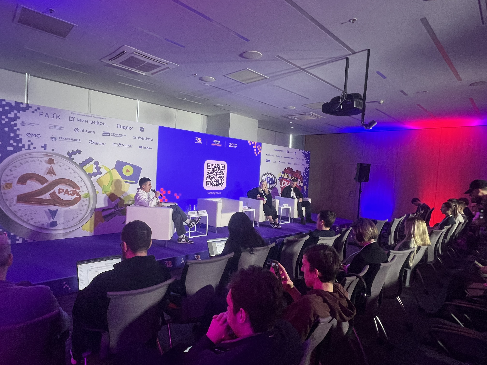
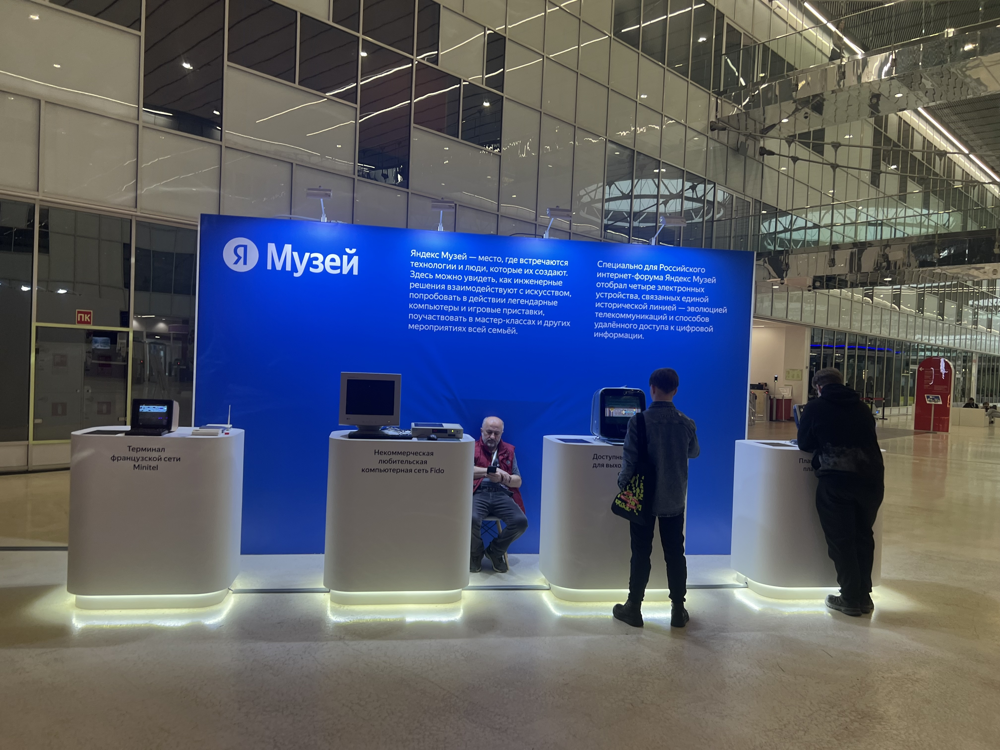
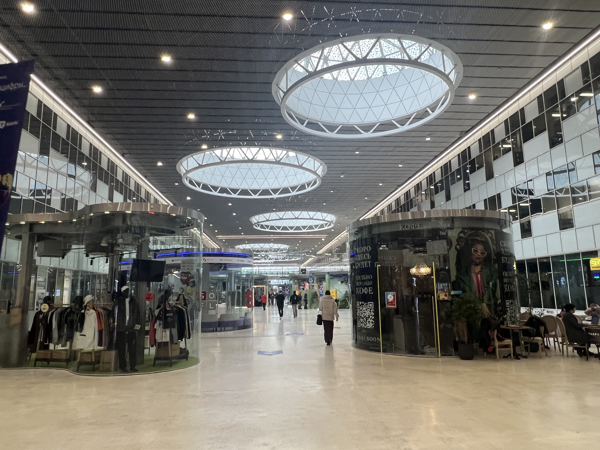

# Отчёт о посещении 30-го Российского Интернет-Форума (РИФ)

## Общая информация
- **Дата и место проведения:** 29 апреля 2026 года, Технопарк «Сколково», г. Москва
- **Организатор:** Ассоциация электронных коммуникаций (РАЭК)
- **Тематика мероприятия:** B2C-коммуникации, цифровые тренды, молодёжная аудитория, IT-сообщество

## Что было на мероприятии
Посетил третий день форума. В программе — дискуссии, воркшопы и презентации от крупных IT-компаний (VK, Яндекс, Wildberries, Avito, Сбер).

**Наиболее интересные секции:**

1. **«Социальные лифты нового поколения»** (14:30–16:00, зал B2)  
   О том, как изменились карьерные траектории, мотивация и ценности молодёжи.

2. **«UGC: как занять нишу и развиваться?»** (12:30–14:00, зал B3)  
   О трендах в создании пользовательского контента и привлечении аудитории.

3. **«Новые правила игры: как поколение Z меняет культуру работы в ИТ»** (14:30–16:00, зал B4)  
   О ценностях молодых специалистов и адаптации компаний под новое поколение.

## Полученные знания и опыт
- Понял, что важно для молодёжи в коммуникации: искренность, юмор, свобода выбора, визуальный стиль.
- Узнал про горизонтальную карьеру и то, что вертикальный рост перестал быть главной целью.
- Увидел, как крупные компании взаимодействуют с年轻ой аудиторией.

## Связь с моим проектом «Симулятор раздачи листовок»
Основываясь на опыте, полученном на форуме, я предложил команде проекта несколько идей:

- **Диалоговая система:** Учитывать психологию молодёжи — добавлять ироничные и абсурдные варианты ответов, избегать пафоса.
- **Персонажи NPC:** Разные типы прохожих (студент, офисный работник, пенсионер) с разными характерами и реакциями.
- **Визуальный стиль:** Сделать акцент на нуарной эстетике, которая сейчас в тренде у молодой аудитории.
- **Продвижение:** Использовать короткие смешные видео в TikTok и Telegram для привлечения игроков.

## Фотографии
*(Загрузите ваши фото в папку `site/images/`)*

## Вывод
Форум помог мне лучше понять современную молодёжную аудиторию и тренды в IT-коммуникациях. Полученные знания я использовал для генерации идей, которые предложил команде проекта. Это должно сделать игру более актуальной и интересной для целевой аудитории.
